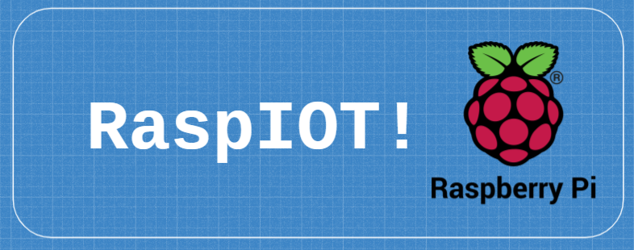

  
  <b>“RaspIOT” - Personalizing the IOT with a RaspberryPi</b>

 

## About the Project

RaspIOT aims to create a personalized IOT device using a RaspberryPi. It gives the user the options to control the functionality of a locally deployed RaspberryPi through a web interface. The interface directly connects to the machine (using ngrok) via HTTP requests, and endpoints for these requests give access to a prepared GPIO - "Breadboard". 

## Initial Advisory

This project was developed as part of the Code Chrysalis Advanced Software Engineering Program, and it has been presented in my Tech Talk on May 22, 2021.
If you would like to get a better idea of what I am trying to achieve, you can find my talk on YouTube:

 

## Aim and Status of the Project

The aim of this project is to give remote access to all features of the Raspberry Pi:

- Small footprint in size, energy use and cost
- Full GPIO accessibility
- Advanced camera functions
- Endless customizability

The project is currently in the development stage, but can be deployed to Heroku by using a service like ngrok.
Both the back-end server and the mock front-end "client" are included in this repo.

Starting the back-end server: NPM run hack
Starting the front-end client: NPM start

## Technologies used

- Raspberry Pi OS
- Node.js
- React
- Axios
- Express Server
- Cors
- ffmpeg.wasm (not yet implemented)
- onoff
- Liquid Crystal
- pi-camera-connect

## Hardware used:

- Raspberry Pi 4, 4GB RAM, 
- 32gb microSD
- Breadboard with GPIO extension Shield
- 1080P 5M Camera
- I2C LCD1602 - Display

## Further Documentation:

- http://johnny-five.io/ (not used in the current version)
- https://github.com/fivdi/onoff
- https://www.npmjs.com/package/pi-camera-connect
- https://github.com/kevincastejon/js-raspberrypi-liquid-crystal
- https://github.com/fivdi/pigpio (not used in the current version)
- https://www.youtube.com/watch?v=TbFFW61KULI&t=1s (CodeChrysalis TechTalk "JavaScript for IoT" by Stefano Demichelis)
- https://developer.mozilla.org/en-US/docs/Web/API/Streams_API/Using_readable_streams

## License 

## Contact

Chris Ackermann
 
Github: [https://github.com/Chris-Ack](https://github.com/Chris-Ack)
 
LinkedIn: [https://www.linkedin.com/in/chris-ackermann/](https://www.linkedin.com/in/chris-ackermann/)
